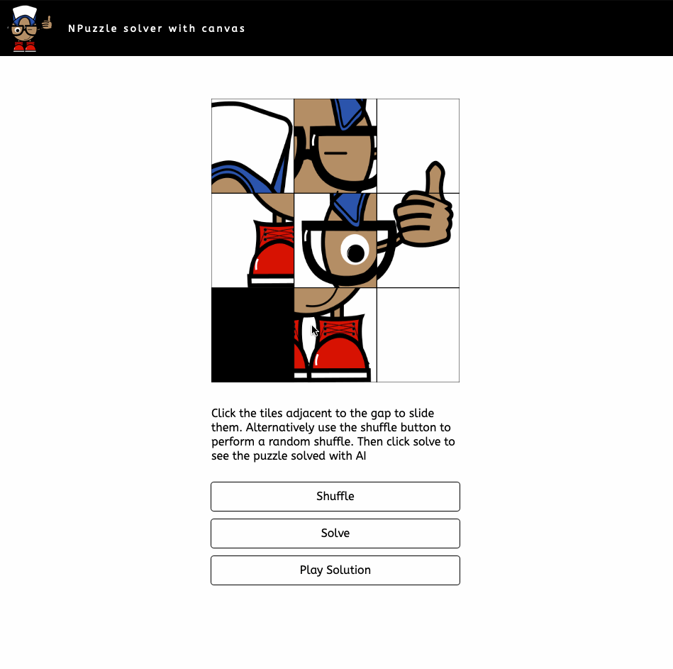

# NPuzzle and AI
Aim: To solve an NPuzzle with Artificial intelligence, and to use Canvas to demonstrate.

The algorithm I chose to use is the IDA* algorithm. I actually wrote [my dissertation](./src/assets/other/dissertation.pdf) on path finding algorithms, so if you're interested in reading further into the several available approaches to solving this puzzle, feel free to check it out

## Prerequisites
- Docker compose
- Docker

## Running
- `./bin/install`
- open `index.html` in your browser

## The Result

